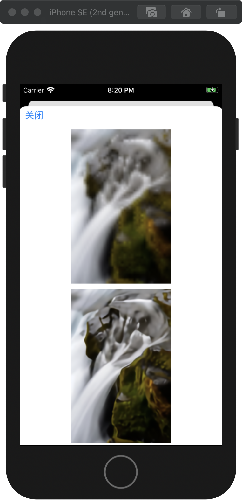

# CAR-IOS

CAR-IOS is a LibTorch-based iOS implement of [CAR](https://github.com/sunwj/CAR), on which is convinent to obtain downscaled image and SR reconstructed image on iOS simulator.

To build this project, it is important to download the [pre-trained TorchScript model](https://pan.baidu.com/s/1cjxW9w296svor2x6nuCcjg) (fetch code: **0xf9**) and add these files to the project in advance

## Sample Result

